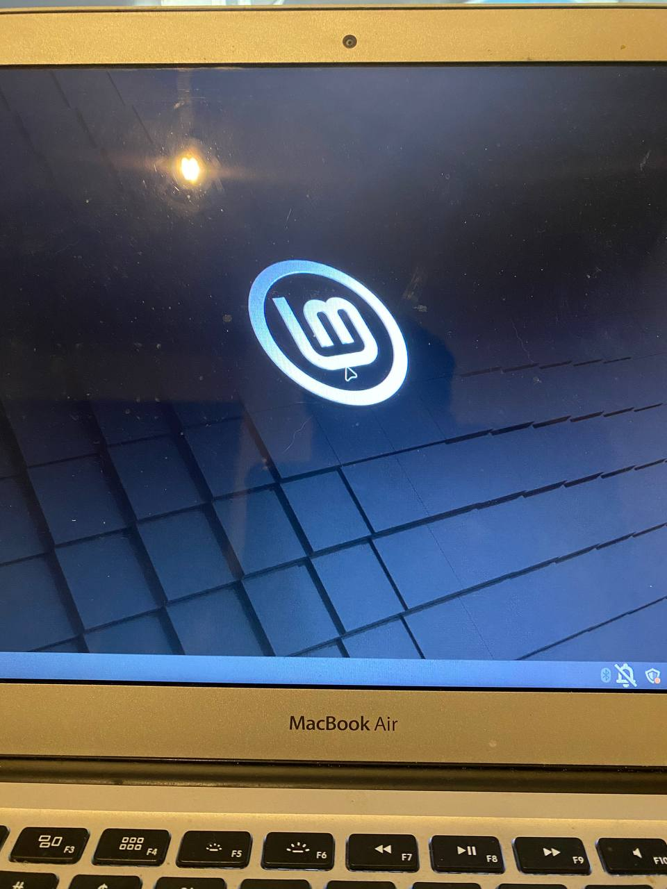

### Peleando contra la obsolescencia

Hace bastante que "adquirí" una MacBook Air Early 2015 para trabajar y, hace un poco menos de tiempo que eso, pero de todas maneras hace bastante, dejé de usarla para el propósito por el que la había comprado: trabajar.

Hace poco más de 4 años que estoy trabajando como desarrollador web fullstack, por lo que una PC que pudiera aguantar un live server de algo como React ya me bastaba.

Por ese motivo, cuando me topé con la oportunidad de obtener la MacBook, no lo pensé demasiado.

Iba muy bien, hasta que los proyectos se fueron haciendo cada vez más grandes.

#### De React a React + Node a React + Node + React Native

Llegó un momento en que, por X o por Y, los proyectos con los que empecé a trabajar se hicieron más grandes. Tener que montar un backend con Node con su respectiva base de datos, más un live server de React y a veces un live server de React Native, se hacía inmanejable. Navegar por la web era tedioso, el fast refresh ya no era tan fast, y cada compilación de la aplicación tardaba minutos.

Al principio busqué alguna alternativa, como dejar de usar VS Code para usar Vim, bajé todas las extensiones de VS Code al mínimo. Nada funcionó.

Terminé yendo a la PC que en ese momento solo usaba para jugar y pasó a ser PC personal y de trabajo.

#### Las bondades de Mac OS

Sin embargo, todo el ecosistema Apple me había gustado, me había pasado a iPhone, en el trabajo me dieron una MacBook Pro Early 2015 que complementaba muy bien en lo que esta MacBook Air flaqueaba, pero de a poco dejé de usarla para centrarme en las otras dos, ya que era todo muy lento.

Aunque para algunas cosas que hacía en casa me seguía sirviendo, era la compu con la que a veces miraba YouTube, conectaba al Apple TV, pero al poco tiempo quedó relegada a ser la compu que solo se abría cuando había que hacer alguna impresión 3D.

Como ya tenía el perfil configurado como necesitaba y no me dejaba a pata, cada vez que había que hacer una impresión 3D, revolvía para encontrarla, cargarla, prenderla, imprimir y al cajón por varios meses más.

#### 4GB de RAM y un i3 en una carcasa muy finita

Cuando volví a la facultad, en la cátedra de programación, de ser posible había que llevar una compu. Yo tenía la MacBook Air que era súper cómoda de transportar y tenía los programas que usaba para programar.

Aunque el primer día que abrí después de no sé cuánto, VS Code era una batata.

Directamente abrí la terminal y me puse a programar con Vim.

Por suerte, para programar algoritmos simples en C/C++ no se necesita mucha navegación de carpetas ni nada muy exagerado, por lo que las primeras clases safé.

A medida que la iba usando más y más, noté que se había vuelto mucho más lenta, tardaba un par de minutos en prender y estar funcional, abrir Brave era tediosamente lento, navegar entre aplicaciones era trabado. Así que, contradiciéndome frente a mis amigos de HackFun, dejé MacOS de lado para ver qué distro de Linux le iba a instalar.

#### De MacOS a MintOS

Después de una ardua investigación (preguntar en HackFun qué distro me recomendaban y hacerle caso a la tercera recomendación) decidí instalar Mint XFCE.

Debo decir que estoy bastante familiarizado con Linux y todas sus bondades, sin embargo, cuando le instalé Mint a la Mac y la prendí, fue realmente sorprendente lo rápido que enganchó.

#### Pocos problemas, muchas soluciones

Apenas instalé Mint XFCE tuve un problema con la placa de red WiFi, nada que no pude solucionar con el Driver Manager y un Ethernet conectado.

Seguido a eso, instalé Brave, Codium e Input Leap. Lo mínimo que iba a usar.

Sin embargo, ya hace varias semanas que estoy testeando y es increíble lo que cambió el rendimiento.

- Encender: en unos segundos ya estoy logueado para usarlo
- Navegar: Por lo menos con hasta 10 pestañas en Brave se maneja muy bien.
- Programar: No solo estoy programando en C/C++ sino que también me puse a resolver cosas del trabajo en React.js con muchos módulos y en un live server, y anda súper fluido.

De todas maneras me siguen faltando cosas por testear:
- Un FrontEnd y un Backend
- Completions de Copilot en algún proyecto grande
- Un navegador cargado con un live server en paralelo.

### ¿El final?

Cabe aclarar que no es mi computadora principal pero, teniendo en cuenta lo rápido que está funcionando y lo útil que está siendo tener una PC cuya batería dure un par de horas y sea liviana, me la estoy llevando a todos lados para tener un acceso rápido a mis cosas o si tengo que resolver alguna emergencia.

#### Proximos pasos

Por el momento la voy a seguir testeando, no quiero agregarle más cosas ya que la idea es mantener todo lo más limpio posible y dejarle lo que necesite para llevar adelante la carrera. 

Me está sirviendo para no tener que imprimir apuntes tanto en la clase como cuando voy a la biblioteca a ponerme al día antes de las clases y estuve notando que, aunque hay veces que la guardo con 20% de bateria y cuando la quiero prender me dice que me quedé sin, muchas otras veces 90% de bateria me alcanza para las 2:30hs-3hs de clases que tengo. 

___

