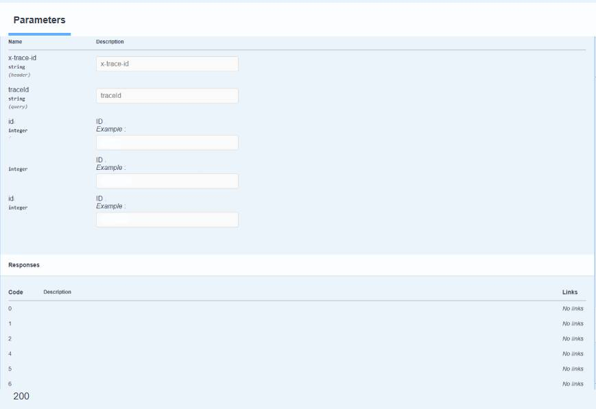
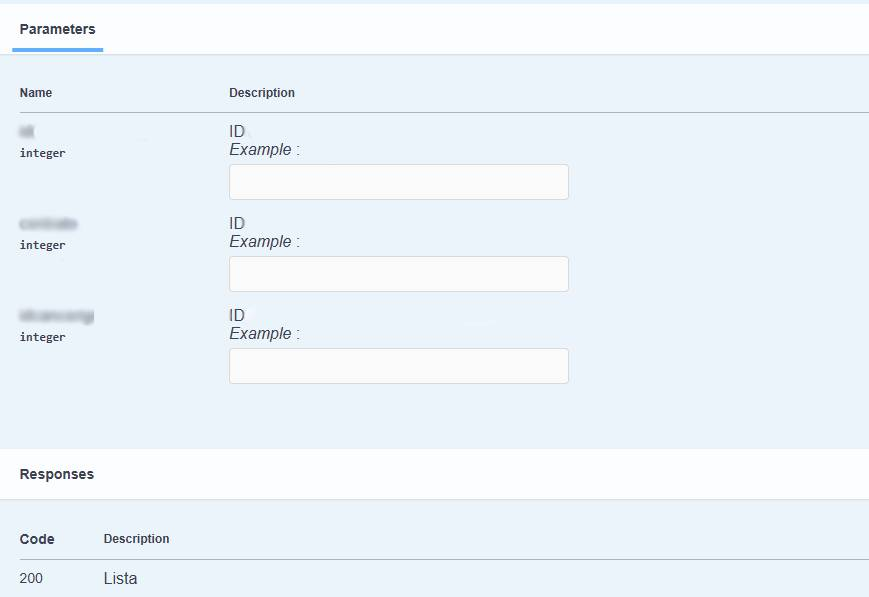

Cuando hay campos automáticos en la documentación de Swagger, autogenerado por el módulo swagger-autogen se puede resolver con una directiva para que no lea el endpoint automáticamente.


Problema: 



Solución: 

Agregar la directiva `#swagger.auto = false`

```javascript

routes.get('/api/usuarios',
  /* 
    #swagger.auto = false <-- 
    #swagger.tags = ['Usuarios']
    #swagger.summary = 'Obtener usuarios'
    #swagger.description = 'Devuelve los usuarios.'
  ...
  */
)
```


